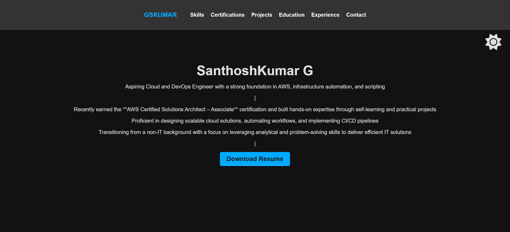

# GSKumar - Cloud & DevOps Portfolio



A personal portfolio website showcasing my skills, certifications, projects, and experience in Cloud and DevOps.

## Features
- Dark/Light mode toggle
- Responsive design
- Sections for Skills, Certifications, Projects, Education, and Experience
- Contact information and social links

## Technologies Used
- HTML5
- CSS3
- JavaScript
- Font Awesome Icons

## Live Demo
[View Portfolio](https://gskumar.tech)

## Setup
1. Clone the repository:
   ```bash
   git clone https://github.com/gskumar-lab/portfolio.git